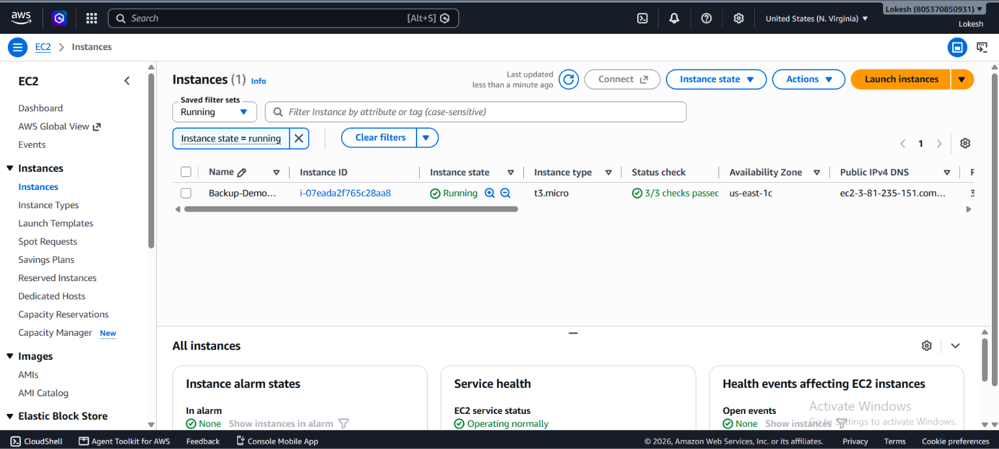
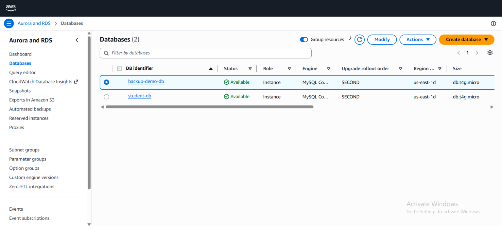

# AWS Backup Plan for EC2 and RDS

## 📌 Project Overview
This project demonstrates how to configure and manage automated backup and recovery for AWS resources using **AWS Backup**. It involves launching an EC2 instance and an RDS instance, and creating a centralized backup plan to protect both resources.

## 🎯 Objective
Learn how to configure and manage automated backup and recovery for AWS resources using AWS Backup, and validate the setup through on-demand backups and recovery point verification.

## 🏗️ Architecture

## 🏗️ Resources Used
| Resource | Details |
|---|---|
| EC2 Instance | Ubuntu, Apache2 web server with sample HTML page |
| RDS Instance | MySQL engine, `testdb` database with a `users` table |
| Backup Vault | `MyBackupVault` (default AWS-managed encryption key) |
| Backup Plan | `MyBackupPlan` with rule `DailyBackupRule` |
| Resource Assignment | `MyResources` (EC2 + RDS, Default IAM role) |

## ⚙️ Backup Configuration
- **Frequency:** Daily
- **Retention period:** 7 days
- **Backup vault:** MyBackupVault
- **IAM role:** AWS Backup Default Service Role

## ✅ Steps Performed
1. Launched an EC2 instance and installed a web server with sample test data.
2. Launched an RDS (MySQL) instance and created a database with sample records.
3. Created a Backup Vault (`MyBackupVault`).
4. Created a Backup Plan (`MyBackupPlan`) with a daily backup rule and 7-day retention.
5. Assigned both the EC2 instance and the RDS database to the backup plan.
6. Triggered on-demand backups for both resources to validate the setup.
7. Verified backup jobs completed successfully in the **Jobs** section.
8. Verified recovery points for both EC2 (Image) and RDS (Snapshot) in the backup vault.

## 📸 Screenshots

### EC2 Instance Running

### RDS Instance Available

### Database Records (MySQL)

### Backup Plan Configuration

### Resource Assignment

### Backup Jobs Completed

### Recovery Points

## 🧪 Validation
- Backup Jobs: **Completed** for both EC2 and RDS ✅
- Recovery Points: 2 (EC2 Image + RDS Snapshot) ✅

## 🚧 Challenges Faced & Resolutions
- **Issue:** Connection timeout when connecting from EC2 to RDS via MySQL client.
  **Cause:** EC2 and RDS were attached to different security groups.
  **Fix:** Added an inbound rule (MySQL/Aurora, port 3306) in the RDS security group, allowing traffic from the EC2 instance's security group.

- **Issue:** Assigned resources did not immediately appear under "Protected resources."
  **Fix:** Triggered on-demand backups directly, which completed successfully and confirmed the resource assignment was working correctly.

## 🛠️ Tools & Services Used
- Amazon EC2
- Amazon RDS (MySQL)
- AWS Backup (Vaults, Backup Plans, Protected Resources, Jobs)
- MySQL Client

## 🧹 Cleanup (Post-Submission)
To avoid ongoing AWS charges:
- Terminate the EC2 instance
- Delete the RDS instance
- (Optional) Delete the Backup Plan and Backup Vault

## 📚 Conclusion
This project provided hands-on experience in setting up a centralized backup strategy for multiple AWS resource types using AWS Backup, along with practical exposure to security group configuration and IAM roles for automated backup operations.
